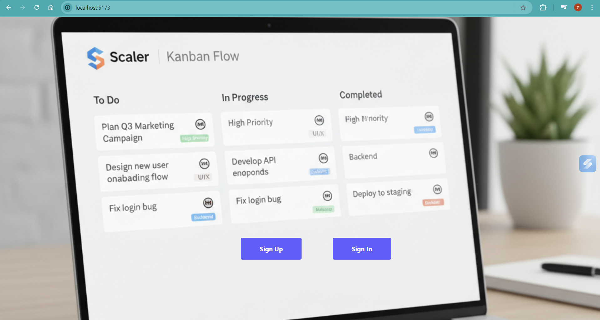
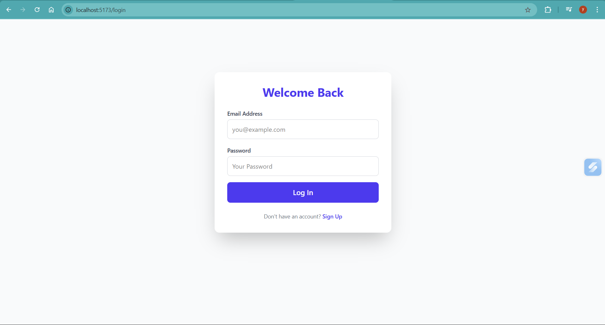
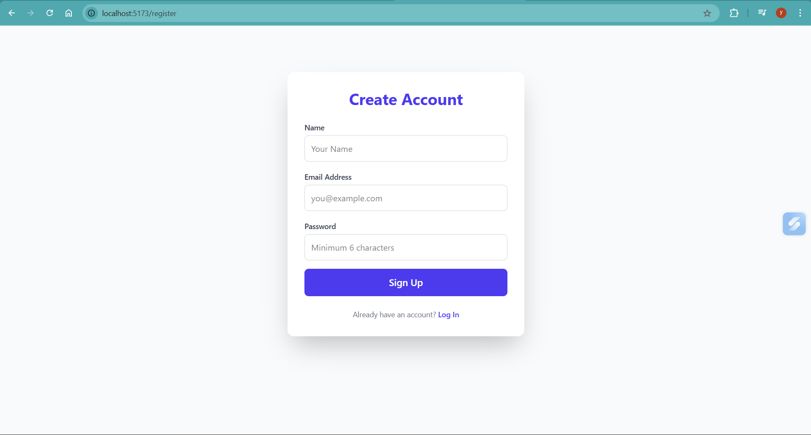
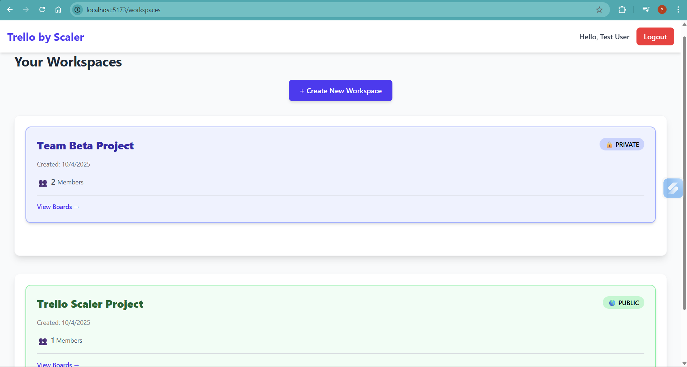
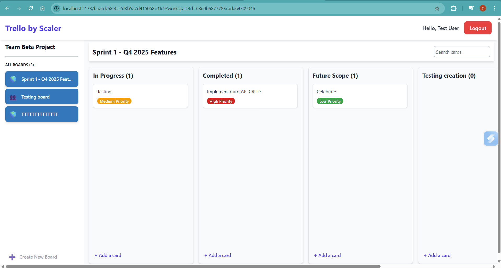

# Mini-Trello (Kanban) Application by Scaler

This repository contains a full-stack implementation of a simplified Trello-like Kanban board, built using the **MERN stack**. It features **real-time collaboration**, **drag-and-drop functionality**, **JWT authentication**, and a **robust, modular API design**. The project is designed to demonstrate both high-level and low-level system design skills while delivering a scalable and production-ready Kanban solution.


## 🌟 Core Features Implemented

* **Full Authentication Flow:** JWT-based signup, login, and protected routes.
* **Real-Time Collaboration:** Live broadcasting of card movements and new comments using **Socket.io** (WebSockets).
* **Kanban Board:** Lists (columns) and Cards with stable ordering via fractional positioning (position float).
* **Search & Filtering:** Text search functionality across card titles, descriptions, and labels within a specific board.
* **Data Hierarchy:** Implements the core entities: Users, Workspaces, Boards, Lists, Cards, Comments, and Activity Log.
* **Authorization Basics:** Basic authorization checks ensure the user is a board member and the board owner can handle invites/removals.

---

## 🛠️ Tech Stack & Rationale

### Backend (Node.js/Express)

| Technology | Rationale |
| :--- | :--- |
| **Express.js** | Provides a minimal and flexible foundation for designing RESTful APIs. |
| **MongoDB/Mongoose** | Chosen for its flexible JSON-like document model, matching the unstructured nature of Kanban cards and activities. Mongoose simplifies schema definition and relational mapping. |
| **JWT** | Standard, secure, and stateless authentication method for REST APIs. |
| **Socket.io** | Protocol chosen for fast, reliable, and bi-directional real-time communication, necessary for live collaboration. |

### Frontend (React/Vite)

| Technology | Rationale |
| :--- | :--- |
| **React** | Component-based architecture for building a dynamic, complex user interface (UI) and composable components. |
| **Vite** | Modern, fast build tool chosen for rapid development and optimized asset bundling, offering significant speed advantages. |
| **Tailwind CSS** | Utility-first CSS framework for rapid, atomic styling and easy component composition. |
| **axios** | Promise-based HTTP client for cleaner, simpler API interaction. |

---

## 📸 Application Screenshots

These images demonstrate the key user flows and interface design of the application.

### 1. Public Landing Page
The entry point showing branding and navigation options (Login/Register) in the top right.


### 2. User Authentication (Sign In & Sign Up)
The dedicated forms used for accessing the application.

| Sign In Page | Sign Up Page |
| :--- | :--- |
|  |  |

### 3. Workspaces Dashboard
The authenticated main view where users can see all their workspaces and create new ones.



### 4. Kanban Board View
The core working area, showing the fixed sidebar, header, horizontal lists, and cards.




---

## ⚙️ Local Setup and Run Steps

These instructions assume you have Node.js (v16+) and a running MongoDB instance (local or Atlas) available. The full setup should take less than 15 minutes.

### 1. Database and Environment Setup

1.  **Clone the Repository:**
    ```bash
    git clone [REPO_URL]
    cd [REPO_NAME]
    ```
2.  **Create `.env`:** In the **`Backend`** folder, create a file named `.env` and populate it using the example below:

    ### .env.example
    ```env
    # .env (in Backend folder)
    PORT=5000
    MONGO_URI="mongodb://localhost:27017/trello_clone_db" 
    JWT_SECRET="YOUR_SUPER_SECURE_RANDOM_STRING_HERE_12345"
    ```

### 2. Backend Initialization (API Server & Real-Time Server)

1.  Navigate to the backend directory:
    ```bash
    cd Backend
    ```
2.  Install dependencies:
    ```bash
    npm install
    ```
3.  Start the server (uses `nodemon` for development):
    ```bash
    npm run dev
    ```
    *(The API and Socket.io server will be running simultaneously on `http://localhost:5000`)*

### 3. Frontend Initialization (React App)

1.  Navigate to the frontend directory:
    ```bash
    cd ../Frontend
    ```
2.  Install dependencies:
    ```bash
    npm install
    ```
3.  Start the client:
    ```bash
    npm run dev
    ```
    *(The application will be running on `http://localhost:5173`)*

---

## 📊 Schema Overview and Key Entities

The application models a strict data hierarchy, utilizing relational references for all core entities.

| Entity | Purpose | Key Relationships & Fields |
| :--- | :--- | :--- |
| **User** | Authentication & identity | `name`, `email`, `password` (hashed). |
| **Workspace** | High-level organizational unit (Team/Org) | `owner` (User), `members` (Array of Users). |
| **Board** | The Kanban surface | `workspaceId` (Workspace), `owner` (User), `members` (Array of Users). |
| **List** | Ordered column | `boardId` (Board), **`position`** (Float for stable ordering). |
| **Card** | Individual task item | `listId` (List), `assignees` (User array), **`position`** (Float), `labels`. |
| **Comment** | Discussion thread on a card | `cardId` (Card), `authorId` (User). |
| **ActivityLog** | Audit trail of board actions | `boardId`, `actorId`, `type`, `metadata`. |

---

## ✅ Verification Checklist (Acceptance Criteria)

Verify the system is fully functional by performing the following checks:

* **Core Flow:** Can create a board, add lists, add/move/edit cards, and add comments.
* **Ordering Persistence:** Drag-and-drop reorders lists & cards, and the new order persists after refreshing the page.
* **Real-Time:** Open the board in a second browser tab. A card move or new comment made in the first tab appears live in the second tab.
* **Search:** Search filters correctly by text/label/assignee within a specific board.
* **Activity Feed:** The board activity feed shows meaningful events (like creation and invites) with the actor and timestamps.